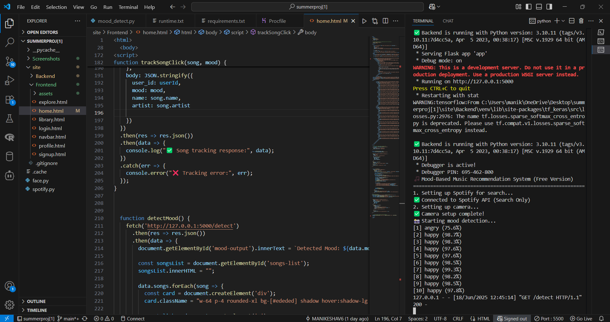
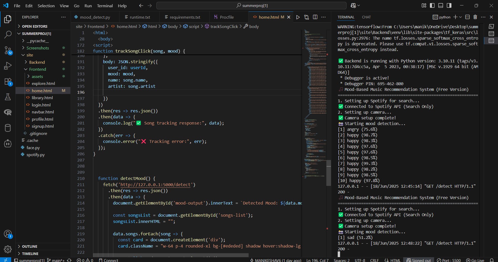
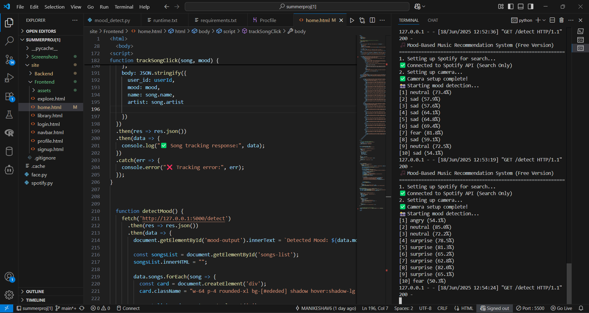
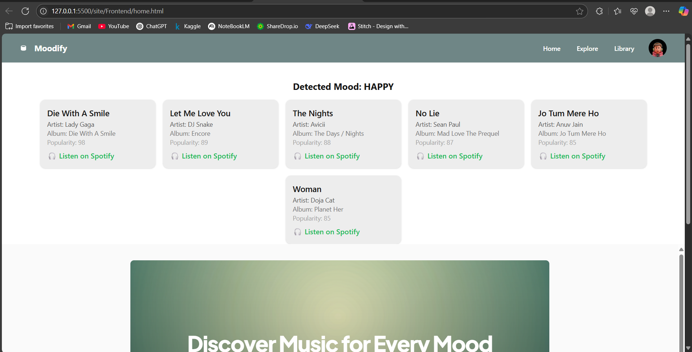
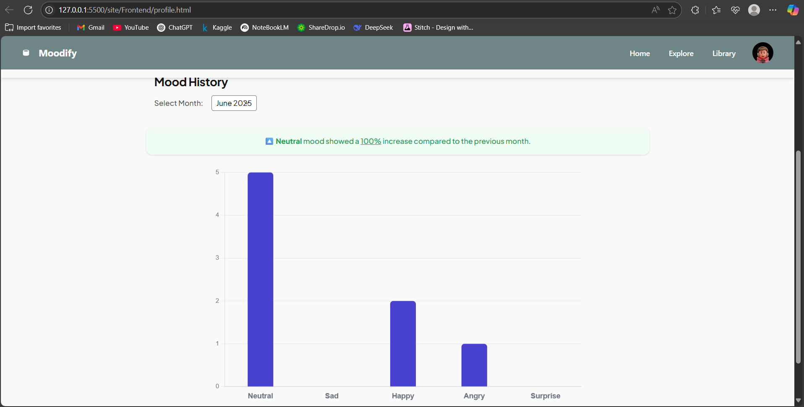

# 🎵 Moodify - Mood-Based Music Recommendation System

Moodify is a smart web-based application that detects your mood using your **webcam** and suggests personalized music playlists. It’s designed to enhance your musical experience based on how you feel — Happy, Sad, Angry, Surprise, or Neutral.

---

## 📸 Demo Screenshots

Below are real-time screenshots captured during mood detection and interaction.

| Mood Detection (Happy) | Mood Detection (Sad) | Mood Detection (Surprise) |
|------------------------|----------------------|----------------------------|
|  |  |  |

|               Detected Result (Happy)                 |                Detected Result (Sad)               |              Detected Result (Surprise)                 |
|-------------------------------------------------------|----------------------------------------------------|---------------------------------------------------------|
|  |  |  |

|               Profile DashBoard                       |                  Detailed-Statistics                      |      
|-------------------------------------------------------|-----------------------------------------------------------|
|          ||

---

## 💡 Features

- 🎥 Detect mood in real-time using webcam.
- 🎶 Show Spotify-based playlist recommendations.
- 📈 Monthly mood trend visualization (3-month history).
- 📝 Add notes based on current mood.
- 📂 User profile with login, signup & mood analysis.
- ⏬ Export mood stats as CSV.
- 🧠 Smart stats modal with mood breakdown.

---

## 🛠 Tech Stack

- **Frontend:** HTML, CSS (Tailwind), JavaScript
- **Backend:** Python (Flask)
- **ML:** DeepFace for mood detection via webcam
- **Database:** SQLite
- **Visualization:** Chart.js

---
## ⚙️ How to Run Locally

 **Important:** This project is not deployed. It must be run on a local system with a webcam.

### 1. Clone the Repository
git clone https://github.com/MANIKESHAV6/Moodify.git

cd Moodify

### 2. Create Virtual Environment & Install Dependencies
cd Backend

python -m venv venv

venv\Scripts\activate            # for Windows

pip install -r requirements.txt

### 3. Start the Backend Server
python app.py

Backend will run on http://127.0.0.1:5000

### 4. Run the Frontend
Navigate to the Frontend folder.

Open 'home.html' in your browser using Live Server or double-click.

---
### ❗Notes
- This application requires a webcam to function.

- Mood detection is done via OpenCV and DeepFace.

- Data is stored only locally via SQLite.

- Not optimized for mobile usage.

---
### Future Improvements
- Deploy backend on cloud with webcam integration (possibly via desktop app).

- Add support for audio mood detection.

- Improve accuracy using custom-trained emotion model.

---
### Author
Mani Keshav

https://github.com/MANIKESHAV6

---
### 📄 License
This project is licensed under the MIT License.
